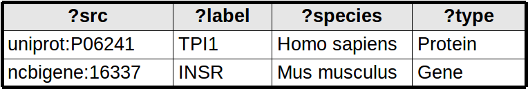
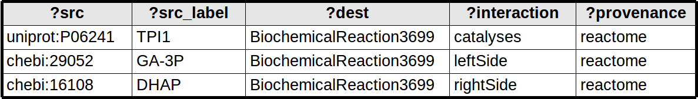
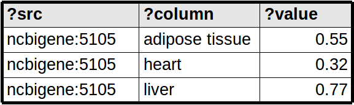

## How does it work?

In the background, the General SPARQL app maintains a list of SPARQL queries. Each item in the search menu, and each item in the context (right-click) menu, is backed by one SPARQL query. When you click on them, a query is sent off in the background, and the result is mapped to your network according to certain rules.

When you first install the app, it comes pre-configured with a basic set of SPARQL queries, although it’s possible to provide your own set. The initial set is designed to work with public bioinformatics SPARQL endpoints provided by the EBI and Bio2RDF. But as great as these resources are, public triple stores can sometimes be overloaded. The app works with privately managed triple stores just as well.

## Configuring your SPARQL endpoint.

You can configure the General SPARQL app to connect to a triple store in several ways. You can adjust the connection in the menu via `App->General SPARQL->Configure Connection`

* Empty Jena Model. This is the default setting and works for navigating public databases. The app sends queries to Jena running in memory, which handles SERVICE requests to remote databases. This is the only way to create a query list that can work with multiple SPARQL endpoints at the same time.
* Local RDF File. The app prompts you to select a file containing RDF data, and subsequent queries are made against this file. Only suitable for small datasets.
* Sparql Endpoint. This works with any SPARQL endpoint. You can optionally set a username and password for endpoints that require authentication. Note that your password will be stored in cleartext on your client computer.
* Virtuoso JDBC. If you have the option to access Virtuoso directly, then this is the most reliable and efficient method of access.

## Creating your own project.xml

The list of queries used are stored in a file named project.xml. You can find the one that comes with the app by default on github here: [project.xml on github](https://github.com/generalbioinformatics/general-sparql-cy3/blob/master/resources/com/generalbioinformatics/cy3/internal/project.xml). But you can create your own and load it into the app through the menu `App->General SPARQL->Load Project`. It's probably easiest to copy this file and start editing it to suit your needs.


<?xml version="1.0" encoding="UTF-8"?>
<MarrsProject title="Public Sparql Endpoints" 
	schemaversion="0.4" pubversion="20150501">
 
 <Query title="Search for a GO identifier" 
        type="QUERY_NODE_ATTRIBUTE">
  <![CDATA[
  PREFIX up:<http://purl.uniprot.org/core/> 
  PREFIX rdfs: <http://www.w3.org/2000/01/rdf-schema#>
  PREFIX fn: <http://www.w3.org/2005/xpath-functions#>
  SELECT distinct ?src  ?label ("GO" AS ?type)
  WHERE 
  {
      SERVICE <http://beta.sparql.uniprot.org/> {
        GRAPH <http://beta.sparql.uniprot.org/go/> {
		  ?src rdfs:label ?label .
          FILTER (?src IN (<http://purl.obolibrary.org/obo/${GOID}>)) .       
        }
      }  
  }
 ]]>
  <AskBefore key="GOID"/>
 </Query>

 <Param key="GOID" val="GO_0000001" />

</MarrsProject>


The general structure of MarrsProject is as follows:

  * One top-level `MarrsProject` element, containing
    * One or more `Query` elements, containing
      * a SPARQL query, wrapped in CDATA for convenience
      * An optional `Context` element. If this element is present, the query will be shown in a right-click menu.
      * An optional `AskBefore` element. If this element is present, a popup dialog will be shown just before the query is run.
    * Followed by Zero or more `Param` elements, defining default values for query substitution parameters.
    * The sample file also contains `NodeAttribute` elements. These are optional, they are part of a future feature that is currently unfinished.

Here is a description of the attributes on each Element:

| Element        | Attribute     | Description           |
| -------------- | ------------- | --------------------- |
| MarrsProject   | title         | Title of your project, will be displayed in the "view queries" dialog |
| MarrsProject   | schemaversion | version of the XML schema, currently 0.4 |
| MarrsProject   | pubversion    | version of the XML contents, use a yyyymmdd date string |
| Query          | title         | title of the query, this will also be displayed in the Search menu or in the Context menu |
| Query          | type          | one of QUERY_NODE_ATTRIBUTE, QUERY_BACKBONE or QUERY_NODE_MATRIX (QUERY_NODE_CONTEXT is a deprecated synonym for QUERY_BACKBONE). Explained in more detail below. |
| Context        | key           | Corresponds to a cytoscape node attribute that is used to determine when to show a context query. For example if `key="type"`, then the query will be added to the context menu only if the node has a certain value for it's type attribute. |
| Context        | value         | Corresponds to the value of a cytoscape node attribute that is used to determine when to show a context query. For example, if `value="Protein"` then the query will be added to the context menu only if the node has the value "Protein" in the right node attribute. |
| AskBefore      | key           | Will cause a pop-up dialog to show just before the query is run, to allow the user to update a query substitution parameter. This attribute indicates the name of the parameter to show |
| Param          | key           | a query substitution parameter, i.e. a parameter that occurs somewhere in a SPARQL query as `${key}` |
| Param          | val           | default value for the given query substitution parameter |

## Query parameter substitution

Any query may have query substitution parameters. A query substitution parameter starts with a `$` sign and is wrapped in braces, like so: `${GOID}`. A default value for a substitution parameter may be defined using a Param element.
A parameter of `${ID}` has a very special meaning: this will be substituted with the ids of all the currently selected nodes.
To prevent SPARQL-injection, the subtitution parameters are checked using a strict filter. You can fine-tune this filter by adding a parameter filter option, as described in this table:

* `${PARAM}`
  No filter defined.
* `${PARAM|uri}`
  PARAM is a uri such as `http://purl.org/uniprot/P42336`
* `${PARAM|uri-bracketed}`
  PARAM is a uri with brackets such as `<http://purl.org/uniprot/P42336>`
* `${PARAM|literal}`
  PARAM is a literal value such as `Glycolysis pathway`
* `${PARAM|uri-list}`
  PARAM is a list of URIs, e.g. `<http://purl.org/uniprot/P42336>, <http://purl.org/uniprot/P42337>`. This is particularly useful for FILTER IN ... patterns.

## Mapping the results of SPARQL queries

You could map RDF triples to a network by using the subject and object as nodes, and the predicate as an edge. But this doesn't always lead to the best possible visualisation. Cytoscape provides node and edge attributes that go beyond basic RDF and give us interesting visualisations options.
The app can map SPARQL results to nodes, node attributes, edges and edge attributes in three different ways.

* QUERY_NODE_ATTRIBUTE
  Node attribute queries map each row from the query result to a node. Each SPARQL binding determines a node attribute. The ?src binding is treated specially - this binding is used for the node identifier (creating new nodes as needed).

  
     
* QUERY_BACKBONE
  Network queries map each row from the query result to an edge. The edge is between two nodes identified as ?src and ?dest (creating new nodes as needed). Any binding that starts with ?src_xxx or ?dest_xxx are treated as node attributes, remaining bindings are treated as edge attributes.

  

* QUERY_NODE_MATRIX
  Matrix queries map each row from the query result to a node attribute, use the binding ?column to indicate which node attribute to use. Thus, the node attributes are not pre-determined but depend on the query results.

  

Up: [Home](index.html)
Previous: [User Manual](usermanual.html)
Next: [About](about.html)

